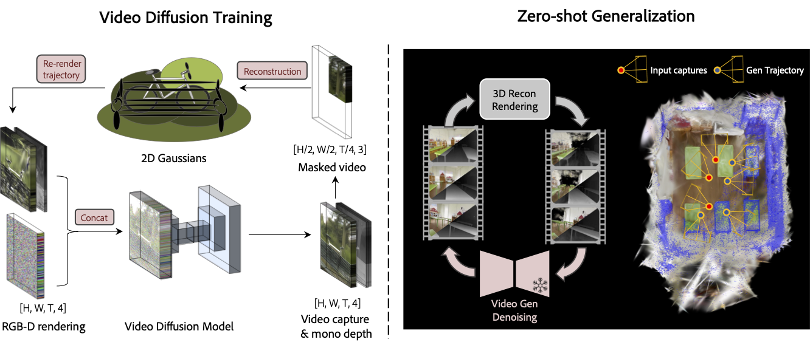

<<<<<<< HEAD
# GenFusion: Closing the Loop between Reconstruction and Generation via Videos

[Project page](https://genfusion.sibowu.com) | [Paper](https://arxiv.org/abs/2503.21219) | [Data (Incoming)](hhttps://genfusion.sibowu.com) <br>



This repo contains the official implementation for the paper "**GenFusion: Closing the loop between Reconstruction and Generation via Videos**". 


## Installation

```bash
conda env create --file environment.yml
conda activate genfusion
cd Reconstruction
CC=gcc-9 CXX=g++-9 pip install submodules/simple-knn
CC=gcc-9 CXX=g++-9 pip install submodules/diff-surfel-rasterization
```
## Generation Model Training

The generation model is finetuned from [DynamiCrafter](https://github.com/Doubiiu/DynamiCrafter).

Step 1. Download the DL3DV Renderings dataset

Step 2. Download pretrained models via Hugging Face, and put the model.ckpt with the required resolution in checkpoints/dynamicrafter_512_v1/model.ckpt.

Step 3. Run the following command to start training on a resolution of 512x320.

```bash
cd ./GenerationModel
sh configs/training_video_v1.0/run_interp.sh
```
Step 4. Finetuned the model on a higher resolution of 960x512.
```bash
sh configs/training_960_v1.0/run_interp.sh
```
If you want to use the model for generation inference, you can download our pre-trained model from [here](https://huggingface.co/Sibo2rr/GenFusion-GenerationModel).

## Reconstruction

If your skip the generation model training, you can download our pre-trained model from [here](https://huggingface.co/Sibo2rr/GenFusion-GenerationModel) and put it in the `./diffusion_ckpt` folder

### Masked 3D Reconstruction

Step 1. The testing scenes in our paper is selected from DL3DV Benchmarkand DL3DV dataset. Download scenes from [Huggingface](https://huggingface.co/datasets/Inception3D/GenFusion_DL3DV_24Benchmark) and put them in the `./data` folder.

Step 2. To get the quantitative results in our paper, you can run the following command.

```bash
cd ./Reconstruction
python genfusion_scripts/batch_ours.py [gpu_ids]
```

To run a masked 3D reconstruction on your own scene, you can use the following command.

```bash
cd ./Reconstruction
python train.py --data_dir [data_dir] \
-m [output_dir] \
--iterations 7_000 \
--test_iterations 7_000 \
--diffusion_ckpt ./diffusion_ckpt/epoch=59-step=34000.ckpt \
--diffusion_config ./generation_infer.yaml \
--num_frames 16 \
--outpaint_type crop \
--start_diffusion_iter 3000 \
--sparse_view 0 \
--downsample_factor 2 \
--diffusion_resize_width 960 \
--diffusion_resize_height 512 \
--diffusion_crop_width 960 \
--diffusion_crop_height 512 \
--patch_size [crop_width] [crop_height] \ # we recommend to use half of the image resolution
--opacity_reset_interval 9000 \
--lambda_dist 0.0 \
--lambda_reg 0.5 \
--lambda_dssim 0.8 \
--densify_from_iter 1000 \
--unconditional_guidance_scale 3.2 \
--repair
```

### Sparse view Reconstruction

Step 1. Download the Mip-NeRF data and train/test split from [ReconFusion](https://drive.google.com/drive/folders/10oT2_OQ9Sjh5wlfJQoGx2y7ZKYwpgNg5)

Step 2. Run the following command to start training.

```bash
cd ./Reconstruction
python genfusion_scripts/batch_sparse.py [gpu_ids]
```

To run a sparse view reconstruction on your own scene, a `train_test_split_{sparse_view}.json` file is required in the following format:

```json
{
  "test_ids": [
    0, 8, 12, ...
  ],
  "train_ids": [
    1, 2, 3, ...
  ]
}
```

Then run the following command:

```bash
python train.py \
--data_dir [data_dir] 
-m [output_dir] \
--iterations 7000 \
--test_iterations 7_000 \
--diffusion_ckpt ./diffusion_ckpt/epoch=59-step=34000.ckpt \
--diffusion_config ./generation_infer.yaml \
--num_frames 16 \
--outpaint_type sparse \
--start_diffusion_iter 1000 \
--sparse_view [num_of_sparse_views] \
--diffusion_resize_width 960 \
--diffusion_resize_height 512 \
--diffusion_crop_width 960 \
--diffusion_crop_height 512 \
--mono_depth \
--repair \
--densify_from_iter 100 \
--diffusion_until 7000 \
--diffusion_every 1000 \
--densify_until_iter 5000 \
--densification_interval 500 \
--opacity_reset_interval 3100 \
--lambda_dist 10.0 \
--lambda_dssim 0.5 \
--lambda_reg 1.0 \
--unconditional_guidance_scale 3.2
```

### Scene Completion
We provide two options to reconstruct the unseen area of the scene.

- Option 1: Pre-defined camera path using [RemoteViewer](https://github.com/hwanhuh/2D-GS-Viser-Viewer), save the trajectory as a json file. Use counter scene in Mip-NeRF360 as an example:
```bash

python train.py \
    --data_dir [data_dir] \
    -m output_ours/counter_completion \
    --test_iterations 7_000 \
    --diffusion_ckpt ./diffusion_ckpt/epoch=59-step=34000.ckpt \
    --diffusion_config ./generation_infer.yaml \
    --num_frames 16 \
    --outpaint_type rotation \
    --add_indices 7 15 \
    --depth_loss \
    --iterations 26000 \
    --diffusion_resize_width 960 \
    --diffusion_resize_height 512 \
    --diffusion_crop_width 960 \
    --diffusion_crop_height 512 \
    --repair \
    --port 6678 \
    --densify_from_iter 500 \
    --densify_until_iter 12000 \
    --diffusion_until 30000 \
    --start_diffusion_iter 5000 \
    --diffusion_every 4000 \
    --opacity_reset_interval 15000 \
    --unconditional_guidance_scale 2.2 \
    --start_dist_iter 3000 \
    --camera_path_file [trajectory file]
```

- Option 2: Use path paramters in the script to determine the shape of sampling path.

```bash
python train.py \
    --data_dir [data_dir] \
    -m [output_dir] \
    --test_iterations 7_000 \
    --diffusion_ckpt ./diffusion_ckpt/epoch=59-step=34000.ckpt \
    --diffusion_config ./generation_infer.yaml \
    --num_frames 16 \
    --outpaint_type rotation \
    --add_indices 7 15 \
    --depth_loss \
    --iterations 26000 \
    --diffusion_resize_width 960 \
    --diffusion_resize_height 512 \
    --diffusion_crop_width 960 \
    --diffusion_crop_height 512 \
    --port 6691 \
    --densify_from_iter 500 \
    --densify_until_iter 12000 \
    --diffusion_until 30000 \
    --start_diffusion_iter 5000 \
    --diffusion_every 4000 \
    --opacity_reset_interval 15000 \
    --repair \
    # define the following parameters for your own scene
    --path_scale 1.0 \ 
    --rotation_angle 90 \
    --position_z_offset 0.5 \
    --distance -0.2 \
    --unconditional_guidance_scale 2.2 \
    --start_dist_iter 3000
```

## Acknowledgements

This project is built upon [2DGS](https://github.com/hbb1/2d-gaussian-splatting) and [DynamiCrafter](https://github.com/Doubiiu/DynamiCrafter). The dataset processing is based on [gsplat](https://github.com/nerfstudio-project/gsplat/tree/main/gsplat). We thank all the authors for their great repos. 


Special thanks to [LiangrunDa](https://github.com/LiangrunDa) for his help on the project website and part of the code. 
=======
## ___***DynamiCrafter: Animating Open-domain Images with Video Diffusion Priors***___
<!-- {: width="50%"} -->
<!--  -->
<div align="center">
</img>


 <a href='https://arxiv.org/abs/2310.12190'></a> &nbsp;
 <a href='https://doubiiu.github.io/projects/DynamiCrafter/'></a> &nbsp;
 <a href='https://huggingface.co/papers/2310.12190'></a> &nbsp;
<a href='https://youtu.be/0NfmIsNAg-g'></a><br>
[](https://openxlab.org.cn/apps/detail/JinboXING/DynamiCrafter)&nbsp;&nbsp;
<a href='https://replicate.com/camenduru/dynami-crafter-576x1024'></a>&nbsp;&nbsp;
<a href='https://github.com/camenduru/DynamiCrafter-colab'></a>&nbsp;
<a href='https://huggingface.co/spaces/Doubiiu/DynamiCrafter'></a>&nbsp;
<a href='https://huggingface.co/spaces/Doubiiu/DynamiCrafter_interp_loop'></a>&nbsp;
<a href='https://openbayes.com/console/public/tutorials/XMVDVpXKN5o'></a>

_**[Jinbo Xing](https://doubiiu.github.io/), [Menghan Xia](https://menghanxia.github.io), [Yong Zhang](https://yzhang2016.github.io), [Haoxin Chen](), [Wangbo Yu](), <br>[Hanyuan Liu](https://github.com/hyliu), [Gongye Liu](), [Xintao Wang](https://xinntao.github.io/), [Ying Shan](https://scholar.google.com/citations?hl=en&user=4oXBp9UAAAAJ&view_op=list_works&sortby=pubdate), [Tien-Tsin Wong](https://ttwong12.github.io/myself.html)**_
<br><br>
From CUHK and Tencent AI Lab.

<strong>at European Conference on Computer Vision (ECCV) 2024, Oral</strong>
</div>
 
## 🔆 Introduction
🔥🔥 Training / Fine-tuning code is available NOW!!!

🔥 We 1024x576 version ranks 1st on the I2V benchmark list from [VBench](https://huggingface.co/spaces/Vchitect/VBench_Leaderboard)!<br>
🔥 Generative frame interpolation / looping video generation model weights (320x512) have been released!<br>
🔥 New Update Rolls Out for DynamiCrafter! Better Dynamic, Higher Resolution, and Stronger Coherence! <br>
🤗 DynamiCrafter can animate open-domain still images based on <strong>text prompt</strong> by leveraging the pre-trained video diffusion priors. Please check our project page and paper for more information. <br>


👀 Seeking comparisons with [Stable Video Diffusion](https://stability.ai/news/stable-video-diffusion-open-ai-video-model) and [PikaLabs](https://pika.art/)? Click the image below.
[](https://www.youtube.com/watch?v=0NfmIsNAg-g)


### 1.1. Showcases (576x1024)
<table class="center">
  <!-- <tr>
    <td colspan="1">"fireworks display"</td>
    <td colspan="1">"a robot is walking through a destroyed city"</td>
  </tr> -->
  <tr>
  <td>
    
  </td>
  <td>
    
  </td>
  </tr>

  <!-- <tr>
    <td colspan="1">"riding a bike under a bridge"</td>
    <td colspan="1">""</td>
  </tr> -->
  <tr>
  <td>
    
  </td>
  <td>
    
  </td>
  </tr>
</table>


### 1.2. Showcases (320x512)
<table class="center">
  <!-- <tr>
    <td colspan="1">"fireworks display"</td>
    <td colspan="1">"a robot is walking through a destroyed city"</td>
  </tr> -->
  <tr>
  <td>
    
  </td>
  <td>
    
  </td>
  </tr>

  <!-- <tr>
    <td colspan="1">"riding a bike under a bridge"</td>
    <td colspan="1">""</td>
  </tr> -->
  <tr>
  <td>
    
  </td>
  <td>
    
  </td>
  </tr>
</table>


### 1.3. Showcases (256x256)

<table class="center">
  <tr>
    <td colspan="2">"bear playing guitar happily, snowing"</td>
    <td colspan="2">"boy walking on the street"</td>
  </tr>
  <tr>
  <td>
    
  </td>
  <td>
    
  </td>
  <td>
    
  </td>
  <td>
    
  </td>
  </tr>


  <!-- <tr>
    <td colspan="2">"two people dancing"</td>
    <td colspan="2">"girl talking and blinking"</td>
  </tr>
  <tr>
  <td>
    
  </td>
  <td>
    
  </td>

  <td>
    
  </td>
  <td>
    
  </td>
  </tr> -->


  <!-- <tr>
    <td colspan="2">"zoom-in, a landscape, springtime"</td>
    <td colspan="2">"A blonde woman rides on top of a moving <br>washing machine into the sunset."</td>
  </tr>
  <tr>
  <td>
    
  </td>
  <td>
    
  </td>

  <td>
    
  </td>
  <td>
    
  </td>
  </tr>

  <tr>
    <td colspan="2">"explode colorful smoke coming out"</td>
    <td colspan="2">"a bird on the tree branch"</td>
  </tr>
  <tr>
  <td>
    
  </td>
  <td>
    
  </td>

  <td>
    
  </td>
  <td>
    
  </td>
  </tr> -->
</table >

### 2. Applications
#### 2.1 Storytelling video generation (see project page for more details)
<table class="center">
    <!-- <tr style="font-weight: bolder;text-align:center;">
        <td>Input</td>
        <td>Output</td>
        <td>Input</td>
        <td>Output</td>
    </tr> -->
  <tr>
    <td colspan="4"></td>
  </tr>
</table >

#### 2.2 Generative frame interpolation

<table class="center">
    <tr style="font-weight: bolder;text-align:center;">
        <td>Input starting frame</td>
        <td>Input ending frame</td>
        <td>Generated video</td>
    </tr>
  <tr>
  <td>
    
  </td>
  <td>
    
  </td>
  <td>
    
  </td>
  </tr>


   <tr>
  <td>
    
  </td>
  <td>
    
  </td>
  <td>
    
  </td>
  </tr>
  <tr>
  <td>
    
  </td>
  <td>
    
  </td>
  <td>
    
  </td>
  </tr> 
</table >

#### 2.3 Looping video generation
<table class="center">

  <tr>
  <td>
    
  </td>
  <td>
    
  </td>
  <td>
    
  </td>
  </tr>
  <!-- <tr>
  <td>
    
  </td>
  <td>
    
  </td>
  <td>
    
  </td>
  </tr> -->
</table >


## 📝 Changelog
- __[2024.06.14]__: 🔥🔥 Release training code for interpolation.
- __[2024.05.24]__: Release WebVid10M-motion annotations.
- __[2024.05.05]__: Release training code.
- __[2024.03.14]__: Release generative frame interpolation and looping video models (320x512).
- __[2024.02.05]__: Release high-resolution models (320x512 & 576x1024).
- __[2023.12.02]__: Launch the local Gradio demo.
- __[2023.11.29]__: Release the main model at a resolution of 256x256.
- __[2023.11.27]__: Launch the project page and update the arXiv preprint.
<br>


## 🧰 Models

|Model|Resolution|GPU Mem. & Inference Time (A100, ddim 50steps)|Checkpoint|
|:---------|:---------|:--------|:--------|
|DynamiCrafter1024|576x1024|18.3GB & 75s (`perframe_ae=True`)|[Hugging Face](https://huggingface.co/Doubiiu/DynamiCrafter_1024/blob/main/model.ckpt)|
|DynamiCrafter512|320x512|12.8GB & 20s (`perframe_ae=True`)|[Hugging Face](https://huggingface.co/Doubiiu/DynamiCrafter_512/blob/main/model.ckpt)|
|DynamiCrafter256|256x256|11.9GB  & 10s (`perframe_ae=False`)|[Hugging Face](https://huggingface.co/Doubiiu/DynamiCrafter/blob/main/model.ckpt)|
|DynamiCrafter512_interp|320x512|12.8GB & 20s (`perframe_ae=True`)|[Hugging Face](https://huggingface.co/Doubiiu/DynamiCrafter_512_Interp/blob/main/model.ckpt)|


Currently, our DynamiCrafter can support generating videos of up to 16 frames with a resolution of 576x1024. The inference time can be reduced by using fewer DDIM steps.

GPU memory consumed on RTX 4090 reported by @noguchis in [Twitter](https://x.com/noguchis/status/1754488826016432341?s=20): 18.3GB (576x1024), 12.8GB (320x512), 11.9GB (256x256).
<!-- It takes approximately 10 seconds and requires a peak GPU memory of 20 GB to animate an image using a single NVIDIA A100 (40G) GPU. -->

## ⚙️ Setup

### Install Environment via Anaconda (Recommended)
```bash
conda create -n dynamicrafter python=3.8.5
conda activate dynamicrafter
pip install -r requirements.txt
```


## 💫 Inference
### 1. Command line
### Image-to-Video Generation
1) Download pretrained models via Hugging Face, and put the `model.ckpt` with the required resolution in `checkpoints/dynamicrafter_[1024|512|256]_v1/model.ckpt`.
2) Run the commands based on your devices and needs in terminal.
```bash
  # Run on a single GPU:
  # Select the model based on required resolutions: i.e., 1024|512|320:
  sh scripts/run.sh 1024
  # Run on multiple GPUs for parallel inference:
  sh scripts/run_mp.sh 1024
```

### Generative Frame Interpolation / Looping Video Generation
Download pretrained model DynamiCrafter512_interp and put the `model.ckpt` in `checkpoints/dynamicrafter_512_interp_v1/model.ckpt`.
```bash
  sh scripts/run_application.sh interp # Generate frame interpolation
  sh scripts/run_application.sh loop   # Looping video generation
```


### 2. Local Gradio demo
### Image-to-Video Generation
1. Download the pretrained models and put them in the corresponding directory according to the previous guidelines.
2. Input the following commands in terminal (choose a model based on the required resolution: 1024, 512 or 256).
```bash
  python gradio_app.py --res 1024
```

### Generative Frame Interpolation / Looping Video Generation
Download the pretrained model and put it in the corresponding directory according to the previous guidelines.
```bash
  python gradio_app_interp_and_loop.py 
```

## 💥 Training / Fine-tuning
### Image-to-Video Generation
0. Download the WebVid Dataset, and important items in `.csv` are `page_dir`, `videoid`, and `name`.
1. Download the pretrained models and put them in the corresponding directory according to the previous guidelines.
2. Change `<YOUR_SAVE_ROOT_DIR>` path in `training_[1024|512]_v1.0/run.sh`
3. Carefully check all paths in `training_[1024|512]_v1.0/config.yaml`, including `model:pretrained_checkpoint`, `data:data_dir`, and `data:meta_path`.
4. Input the following commands in terminal (choose a model based on the required resolution: 1024 or 512).

We adopt `DDPShardedStrategy` by default for training, please make sure it is available in your pytorch_lightning.
```bash
  sh configs/training_1024_v1.0/run.sh ## fine-tune DynamiCrafter1024
```
5. All the checkpoints/tensorboard record/loginfo will be saved in `<YOUR_SAVE_ROOT_DIR>`.

### Generative Frame Interpolation
Download pretrained model DynamiCrafter512_interp and put the `model.ckpt` in `checkpoints/dynamicrafter_512_interp_v1/model.ckpt`. Follow the same fine-tuning procedure in "Image-to-Video Generation", and run the script below:
```bash
sh configs/training_512_v1.0/run_interp.sh
```


## 🎁 WebVid-10M-motion annotations (~2.6M)
The annoations of our WebVid-10M-motion is available on [Huggingface Dataset](https://huggingface.co/datasets/Doubiiu/webvid10m_motion). In addition to the original annotations, we add three more motion-related annotations: `dynamic_confidence`, `dynamic_wording`, and `dynamic_source_category`. Please refer to our [supplementary document](https://arxiv.org/pdf/2310.12190) (Section D) for more details.


## 🤝 Community Support

1. ComfyUI and pruned models (bf16): [ComfyUI-DynamiCrafterWrapper](https://github.com/kijai/ComfyUI-DynamiCrafterWrapper) (Thanks to [kijai](https://twitter.com/kijaidesign))


|Model|Resolution|GPU Mem. |Checkpoint|
|:---------|:---------|:--------|:--------|
|DynamiCrafter1024|576x1024|10GB |[Hugging Face](https://huggingface.co/Kijai/DynamiCrafter_pruned/blob/main/dynamicrafter_1024_v1_bf16.safetensors)|
|DynamiCrafter512_interp|320x512|8GB |[Hugging Face](https://huggingface.co/Kijai/DynamiCrafter_pruned/blob/main/dynamicrafter_512_interp_v1_bf16.safetensors)|


2. ComfyUI: [ComfyUI-DynamiCrafter](https://github.com/chaojie/ComfyUI-DynamiCrafter) (Thanks to [chaojie](https://github.com/chaojie))

3. ComfyUI: [ComfyUI_Native_DynamiCrafter](https://github.com/ExponentialML/ComfyUI_Native_DynamiCrafter) (Thanks to [ExponentialML](https://github.com/ExponentialML))

4. Docker: [DynamiCrafter_docker](https://github.com/maximofn/DynamiCrafter_docker) (Thanks to [maximofn](https://github.com/maximofn))


## 👨‍👩‍👧‍👦 Crafter Family
[VideoCrafter1](https://github.com/AILab-CVC/VideoCrafter): Framework for high-quality video generation.

[ScaleCrafter](https://github.com/YingqingHe/ScaleCrafter): Tuning-free method for high-resolution image/video generation.

[TaleCrafter](https://github.com/AILab-CVC/TaleCrafter): An interactive story visualization tool that supports multiple characters.  

[LongerCrafter](https://github.com/arthur-qiu/LongerCrafter): Tuning-free method for longer high-quality video generation.  

[MakeYourVideo, might be a Crafter:)](https://doubiiu.github.io/projects/Make-Your-Video/): Video generation/editing with textual and structural guidance.

[StyleCrafter](https://gongyeliu.github.io/StyleCrafter.github.io/): Stylized-image-guided text-to-image and text-to-video generation.

[ViewCrafter](https://github.com/Drexubery/ViewCrafter): Novel view synthesis by taming camera-pose-controlled DynamiCrafter.
## 😉 Citation
Please consider citing our paper if our code and dataset annotations are useful:
```bib
@article{xing2023dynamicrafter,
  title={DynamiCrafter: Animating Open-domain Images with Video Diffusion Priors},
  author={Xing, Jinbo and Xia, Menghan and Zhang, Yong and Chen, Haoxin and Yu, Wangbo and Liu, Hanyuan and Wang, Xintao and Wong, Tien-Tsin and Shan, Ying},
  journal={arXiv preprint arXiv:2310.12190},
  year={2023}
}
```

## 🙏 Acknowledgements
We would like to thank [AK(@_akhaliq)](https://twitter.com/_akhaliq?lang=en) for the help of setting up hugging face online demo, and [camenduru](https://twitter.com/camenduru) for providing the replicate & colab online demo, and [Xinliang](https://github.com/dailingx) for his support and contribution to the open source project.

## 📢 Disclaimer
This project strives to impact the domain of AI-driven video generation positively. Users are granted the freedom to create videos using this tool, but they are expected to comply with local laws and utilize it responsibly. The developers do not assume any responsibility for potential misuse by users.
****
>>>>>>> 859021927d8e0f8eb4d91d16f86711b8c25a2023
